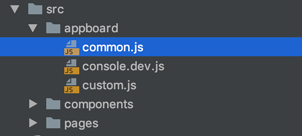
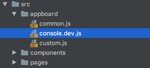

# appboard


## 功能介绍

eeui默认采用的分包模式，即一个页面一个vue，这样做的缺点是，共有的js会被添加进每一个vue里面假设有`100个页面`，共有js的体积是`100kb`，那么最终编译的体积是`100x100=10000kb`,现在采用appboard，共有js有native拼接引入，如此一来，共有js不再编译到每一个vue里面，最终体积变成了`100x1=100kb`

## 使用说明

只要将`js`文件放置`src/appboard/`目录下即可，例如：`src/appboard/common.js`



如果在`js`文件后缀之前加上`.dev`表示只有开发环境引用，例如：`src/appboard/console.dev.js`




## 建议参考

建议在`appboard`中使用`混合（Minins）`方式使用对象函数，例如`src/appboard/common.js`中代码如下：

```js
const eeui = app.requireModule('eeui');

Vue.mixin({
    methods: {

        tishi(str) {
            eeui.toast(str);
        }
        
    }
});
```

那么接下来在vue页面中只需要使用`this.tishi(xxx)`即可：

```vue
<template>
    <div class="app">
        <text @click="clickDemo">点击demo</text>
    </div>
</template>

<script>
    export default {
        methods: {
            clickDemo() {
                this.tishi("点击到了")
            },
        }
    };
</script>
```