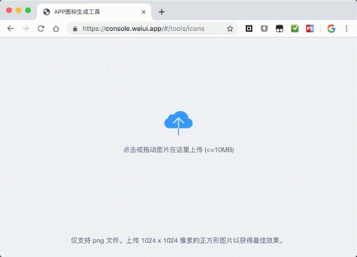

# 应用图标

## 生成新图标

打开图标生成工具[https://console.eeui.app/#/tools/icons](https://console.eeui.app/#/tools/icons)上传并生成图片

## 修改iOS图标

> iOS覆盖路径为：platforms/ios/eeuiApp/eeuiApp/Assets.xcassets/AppIcon.appiconset/

## 修改Android图标

> Android覆盖路径为：platforms/android/eeuiApp/app/src/main/res/mipmap-xxxx/

