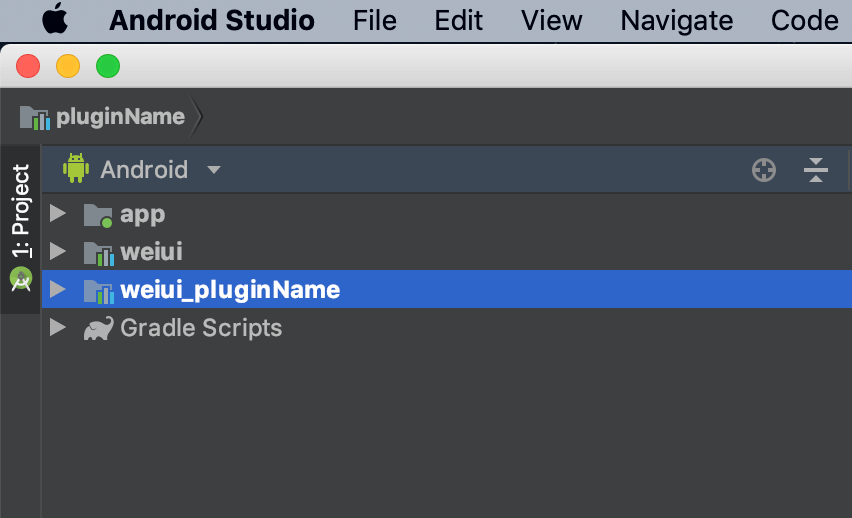
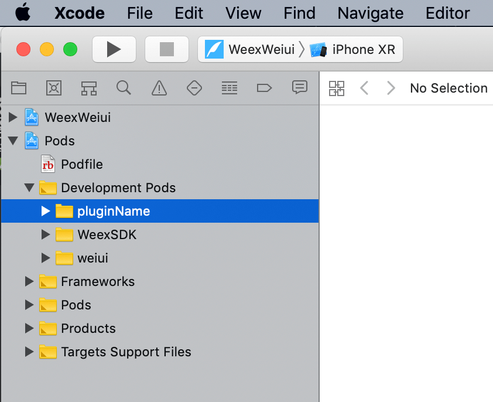

# 创建插件 <Tag value="2.x"/>

在项目根目录下运行以下命令创建插件：

```bash
eeui plugin create {用户名}/{插件名}
```

例如：

```bash
eeui plugin create uname/example
```

> 运行看到相关提示表示创建成功。

创建成功后插件对应目录结构为：

```text
项目根目录
    └── plugins                     
        └── example                 
            ├── android             // Android 插件目录
            ├── ios                 // iOS 插件目录
            ├── script               
            │   ├── install.js            // 安装插件时会node运行此文件
            │   └── uninstall.js          // 卸载插件时会node运行此文件
            └── config.json         // 配置文件
```


**重启IDE以后可以看到如下图开发目录：**

* Android 端会看到一个如图名为`unameExample`的插件



* iOS 端会看到一个如图名为`unameExample`的插件

