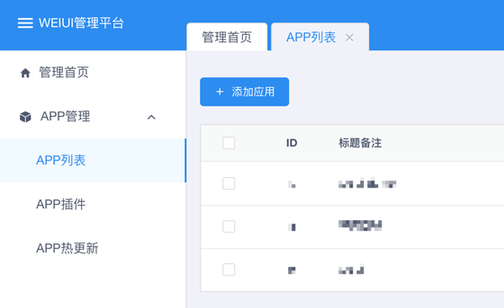
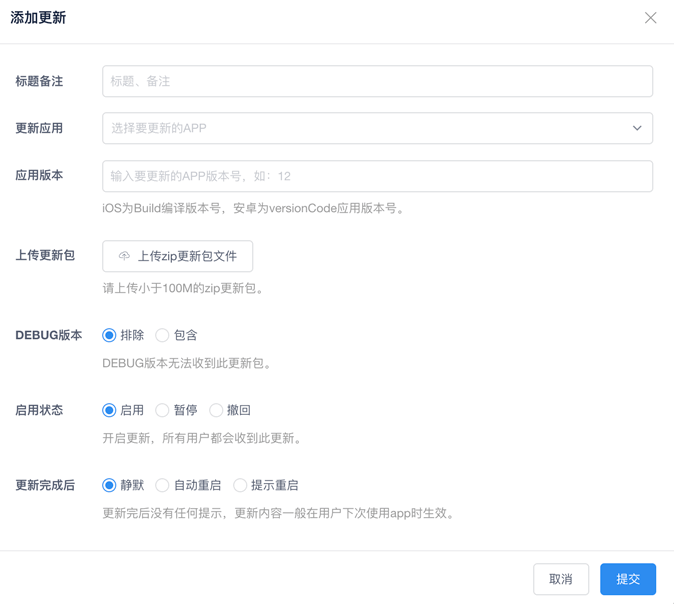
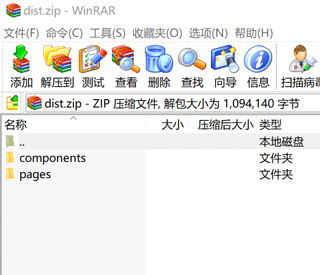

# 热更新

## 功能介绍

热更新（修复）可以实现快速版本迭代，快速修复bug。不用发布新的apk或者ipa版本（只要把您改动的`页面`、`config配置`、`图片`上传）既可对你的app进行更新。

::: tip
已支持在自己的服务器搭建服务端（热更新、动态设置启动图等），详阅[eeui.config.js配置文件](./config.html)。<Tag value="1.0.17+"/>
:::


## 方法一：一键自动更新 <Tag value="1.0.16+"/>

```bash
eeui repair
```

注：只需要在项目根目录下执行`eeui repair`命令即可一键自动生成热更新包并上传至控制台。

## 方法二：手动添加更新

#### 1、登录注册

点击链接进入 [EEUI.APP控制台](https://console.eeui.app/#/manage/) 即可一键注册登录。

#### 2、添加应用

注册登录后进入面板，依次点击左侧`APP管理`&gt;&gt;`APP列表`&gt;&gt;`添加应用`。如下图：



#### 3、新增热更新

点击左侧`APP热更新`&gt;&gt;`添加更新`，按需填写上传zip更新包即可。如下图：



#### 4、zip更新包说明

::: tip
将`common/dist/`目录下文件按原结构打包成zip压缩包即可。
:::

目录结构示例：

```
zip更新包
├── components 
├── ......
└── pages                 
    ├── ......
    └── index.js
```

目录结构图示：


